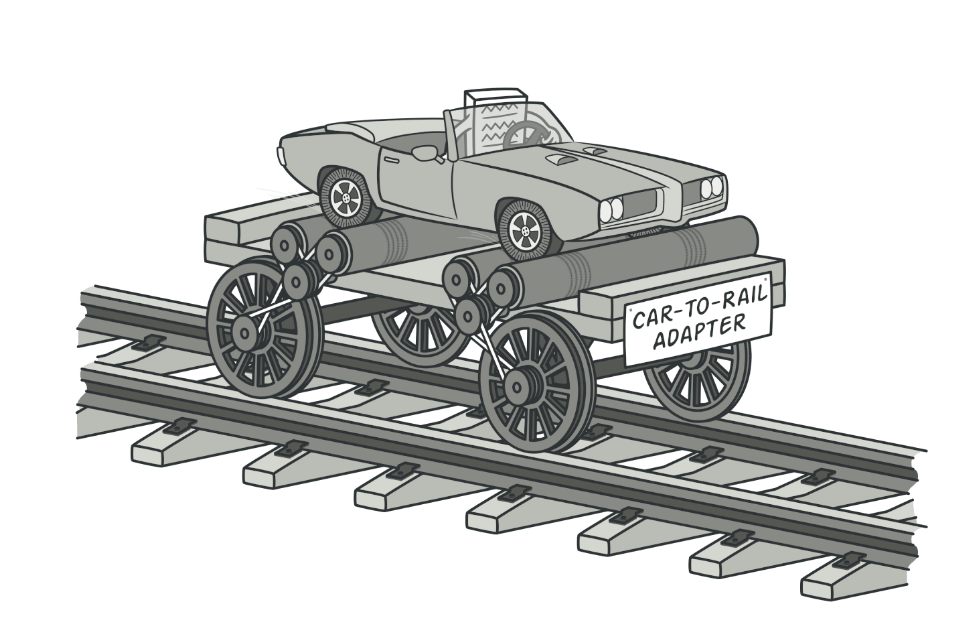
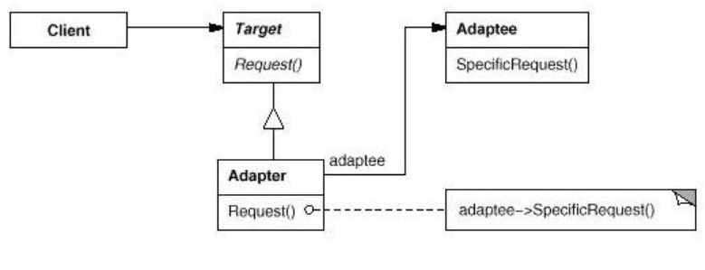
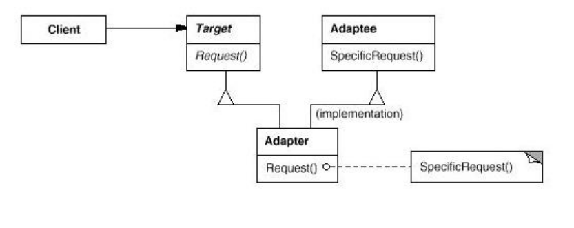

# Adapter design pattern
>
Technology: C++

>
Author: Pawel Losik 

## About pattern:
Adapter also known as Wrapper is structural design pattern which allows objects with incompatible interfaces to collaborate each other. 

## Structure:
There are two kinds of adapters( base on composition vs inheritance).
* Object Adapters (based on composition)
* Class Adapters (based on inheritance)

### Adapter object
Object Adapters use a compositional technique to adapt one interface to another. The adapter inherits the target interface that the client expects to see, while it holds an instance of adaptee. Object adapters enable the client and the adaptee to be completely decoupled from eachother. Only the adapter knows about both of them.

### Adapter class

Class adapters use multiple inheritance to achieve their goals. As in the object adapter, the class adapter inherits the interface of the client’s target. However, it also inherits the interface of the adaptee as well. 

## Adapter objects vs Adapter class

* Adapter object uses composition it can not only adapt an adaptee class, but any of their subclasses. It is flexible.
* Adapter class Uses inheritance, overriding target class methods, doing "translation" behavior of the adapted class.
* Difficult to adapt subclasses of the adapted class.
* Common problems with multiple inheritance may arise.
* Note that class adapters have a problem with name conflicts if methods of the same signature exist on both the target and the adaptee. Note that just because two objects have methods that have the same signature (syntax), it does not guarantee that the two methods have the same meaning or behavior (sematics). That is, the two methods do not necessarily map directly to each other. Object adapters do not have this problem.
*  Class adapters are simpler than object adapters in that they involve fewer classes and are useful if total decoupling of the client and adaptee is not needed.

## Why use Adapter pattern ? 
* Sometimes a toolkit or class library can not be used because their interface is incompatible with the interface required by an application.
* We can not change the library interface, or we may not have a source code.
* Even if we did have the source code, we probably should not change the library for each domain-specific application.

## When use Adapter pattern ? 
* When you want to use an existing class, and their interface does not match the one you need. 
* When You want to create a reusable class that cooperates with unrelated classes with incompatible interfaces.

## Pros and cons
+ Single Responsibility Principle. You can separate the interface or data conversion code from the primary business logic of the program.
+ Open/Closed Principle. You can introduce new types of adapters into the program without breaking the existing client code, as long as they work with the adapters through the client interface.

- The overall complexity of the code increases because you need to introduce a set of new interfaces and classes. Sometimes it’s simpler just to change the service class so that it matches the rest of your code.
